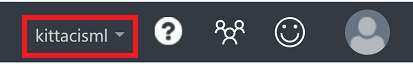
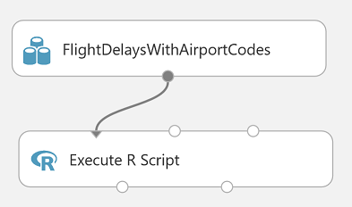
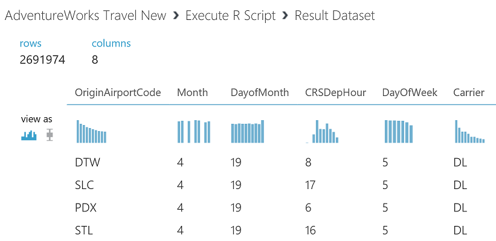
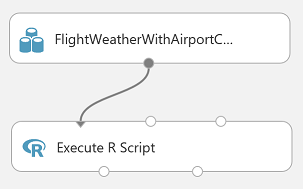
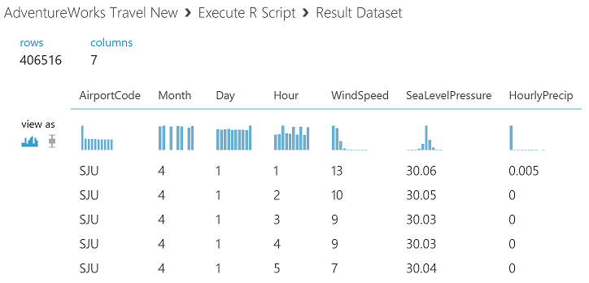
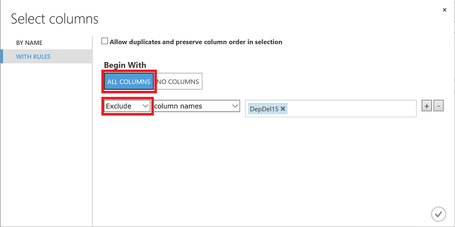
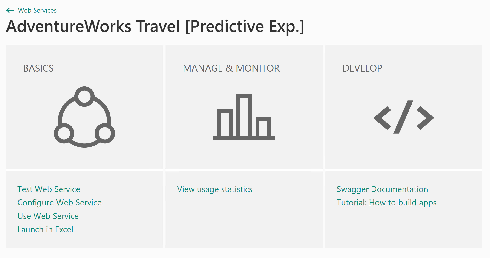
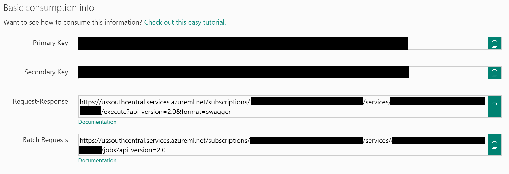

# Exercise 1: Building a Machine Learning Model

Duration: 90 mins

Synopsis: In this exercise, attendees will implement a classification experiment. They will load the training data from their local machine into a dataset. Then they will explore the data to identify the primary components they should use for prediction, and use two different algorithms for predicting the classification. They will evaluate the performance of both and algorithms choose the algorithm that performs best. The model selected will be exposed as a web service that is integrated with the sample web app.

This exercise has 9 tasks:

* [Task 1: Connect to the Lab VM](#task-1-connect-to-the-lab-vm)
* [Task 2: Navigate to Machine Learning Studio](#task-2-navigate-to-machine-learning-studio)
* [Task 3: Upload the Sample Datasets](#task-3-upload-the-sample-datasets)
* [Task 4: Start a New Experiment](#task-4-start-a-new-experiment)
* [Task 5: Prepare the Weather Data](#task-5-prepare-the-weather-data)
* [Task 6: Join the Flight and Weather Datasets](#task-6-join-the-flight-and-weather-datasets)
* [Task 7: Train the Model](#task-7-train-the-model)
* [Task 8: Operationalize the Experiment](#task-8-operationalize-the-experiment)
* [Task 9: Deploy Web Service and Note API Information](#task-9-deploy-web-service-and-note-api-information)

## Get out of Jail Free

If, for whatever reason, you cannot complete this lab whether due to time contraints or if you are not able to troubleshoot an issue, we have created a "get out of jail free" exercise. If you wish to use this exercise at any time, please proceed to [Appendix A](09 Appendix A - Alternative to Azure ML Exercise.md). After completing Appendix A, you can continue to [Exercise 2](02 Exercise 2 - Setup Azure Data Factory.md).

## Task 1: Connect to the Lab VM

1. From the left side of the Azure portal, click on **All resources**.
2. In the **Filter items...** box, type in **lab**.
3. Select your lab VM. Keep in mind the name of the virtual machine will begin with the "app name" you provided when setting up this workshop environment (in the prerequisite deployment).
2. At the top of the blade for your VM, click on **Connect**.

    

3. Download and open the RDP file.
1. When the **Remote Desktop Connection** screen appears, check the **Don't ask me again...** box and click on **Connect** button.

    

1. Log in with the following credentials:
   - User name: **cortana**
   - Password: **Password.1!!**

## Task 2: Navigate to Machine Learning Studio

1. In a browser, go to [https://studio.azureml.net](https://studio.azureml.net) and log in using the same account you used in the Azure portal to deploy the prerequisites for this workshop.
2. Once you are signed in, ensure the workspace that was created as part of the prerequisites is selected from the top bar. **Make sure** you select the correct workspace; if you do not you might run into issues in subsequent steps.

    

## Task 3: Upload the Sample Datasets

1. Before you begin creating a machine learning experiment, there are three datasets you need to load.
2. Download the three CSV sample datasets from here: http://aka.ms/awtdata and save AdventureWorksTravelDatasets.zip to your Desktop.
   - **Note:** You will need to unblock the zip file before extracting its files. Do this by right clicking on it, selecting **Properties**, and then unblocking the file in the resulting dialog.
3. Extract the ZIP and verify you have the following files:
   - FlightDelaysWithAirportCodes.csv
   - FlightWeatherWithAirportCode.csv
   - AirportCodeLocationClean.csv
4. Click **+ NEW** at the bottom, point to **Dataset** , and select **From Local File**.

    

5. In the dialog that appears, click **Choose File** and browse to the **FlightDelaysWithAirportCodes.csv** file and click **OK**.
6. Change the name of the dataset to **FlightDelaysWithAirportCodes**.
7. Click on the check mark on the bottom right corner of the screen.

    

8. Repeat the previous step for the **FlightWeatherWithAirportCode.csv** and **AirportCodeLocationLookupClean.csv** setting the name for the dataset in a similar fashion.

## Task 4: Start a New Experiment

1. Click **+ NEW** in the command bar.
2. In the options that appear, click **Blank Experiment**.

    

3. Give your new experiment a name, such as **AdventureWorks Travel** by editing the label near the top of the design surface.

    

4. In the toolbar on the left, in the Search experiment items box, type the name of the dataset you created with flight delay data (FlightDelaysWithAirportCodes). You should see a component for it listed under **Saved Datasets** -> **My Datasets**.

    

5. Click and drag on the **FlightDelaysWithAirportCodes** to add it to the design surface.

    

6. Next, you will explore each of the datasets to understand what kind of cleanup (aka data munging) will be necessary.
7. Hover over the output port of the **FlightDelaysWithAirportCodes** dataset.

    

8. Right click on the port and select **Visualize**.

    

9. A new dialog will appear showing a maximum of 100 rows by 100 columns sample of the dataset. You can see at the top that the dataset has a total of 2,719,418 rows (also referred to as examples in Machine Learning literature) and has 20 columns (also referred to as features).

    

10. Because all 20 columns are displayed, you can scroll the grid horizontally. Scroll until you see the **DepDel15** column and click it to view statistics about the column. The **DepDel15** column displays a 1 when the flight was delayed at least 15 minutes and 0 if there was no such delay. In the model you will construct, you will try to predict the value of this column for future data.

    

11. Notice in the Statistics panel that a value of 27444 appears for Missing Values. This means that 27,444 rows do not have a value in this column. Since this value is very important to our model, we will eliminate any rows that do not have a value for this column. In fact, removing these missing values is just one of several "data wrangling" tasks that need to be done. Here is a list of tasks that we will need to do on this dataset before it is ready to be processed by a machine learning algorithm.
    1. Remove rows with missing **DepDel15** values.
    1. Create a new column that represents the departure hour. This will be based on the **CRSDepTime** column.
    1. Trim down the list of columns needed to do the analysis at hand.

12. In order to perform the aforementioned data manipulation tasks, you could use built-in Azure ML modules for each task or you could use a script (such as R or Python). Here, you will use R. To do this, add an **Execute R Script** (recall you can search for modules on the left) module beneath the flights dataset and connect the output of the dataset to the first input port (leftmost) of the **Execute R Script**.

    

37. In the **Properties** panel for **Execute R Script**, click the "double window" icon to maximize the script editor.

    

38. Replace the default script with the following and click the checkmark to save it.

    ``` R
    ds.flights <- maml.mapInputPort(1)

    # Remove rows with missing values in DepDel15
    ds.flights <- ds.flights[!is.na(ds.flights$DepDel15), ]

    # Create a column for departure hour called CRSDepHour
    ds.flights$CRSDepHour <- floor(ds.flights$CRSDepTime / 100)

    # Trim the columns to only those we will use for the predictive model
    ds.flights = ds.flights[, c("OriginAirportCode", "Month", "DayofMonth", "CRSDepHour", "DayOfWeek", "Carrier", "DestAirportCode", "DepDel15")]

    maml.mapOutputPort("ds.flights");
    ```

39. Run the experiment to update the metadata and process the data (this may take a minute or two to complete).
40. Right click on the leftmost output port of your **Execute R Script** module and select **Visualize**.
41. Compare the data in this view with the data before it was processed by the R script (recall the list of manipulations above). Verify that the dataset only contains the 8 columns referenced in the R script.

    

42. At this point the Flight Delay Data is prepared, and we turn to preparing the historical weather data.

## Task 5: Prepare the Weather Data

1. To the right of the **FlightDelaysWithAirportCodes** dataset, add the **FlightWeatherWithAirportCode** dataset.

    

2. Right click the output port of the **FlightWeatherWithAirportCode** dataset and select **Visualize**.

    

3. Observe that this data set has 406,516 rows and 29 columns. For this model, we are going to focus on predicting delays using WindSpeed (in MPH), SeaLevelPressure (in inches of Hg), and HourlyPrecip (in inches). We will focus on preparing the data for those features.
4. In the dialog, click the **WindSpeed** column and review the statistics. Observe that the Feature Type was inferred as String and that there are 32 Missing Values. Below that, examine the histogram to see that, even though the type was inferred as string, the values are all actually numbers (e.g. the x-axis values are 0, 6, 5, 7, 3, 8, 9, 10, 11, 13). We will need to ensure that we remove any missing values and convert WindSpeed to its proper type as a numeric feature.

    

5. Next, click the **SeaLevelPressure** column. Observe that the Feature Type was inferred as String and there are 0 Missing Values. Scroll down to the histogram, and observe that many of the features of a numeric value (e.g., 29.96, 30.01, etc.), but there are many features with the string value of M for Missing. We will need to replace this value of M with a suitable numeric value so that we can convert this feature to be a numeric feature.

    

6. Finally, examine the **HourlyPrecip** feature. Observe that it too was inferred to have a Feature Type of String and is missing values for 374,503 rows. Looking at the histogram, observe that besides the numeric values, there is a value T for Trace amount of rain). We will need to replace the T with a suitable numeric value and covert this feature to a numeric feature.

    

7. As with the manipulation of the flight data, here you will use R script to perform the necessary data manipulation tasks on the weather data. The following steps will be taken:
    1. Substitue missing values in the **HourlyPrecip** and **WindSpeed** columns.
    1. Create a new column called **Hour** based on the **Time** column.
    1. Replace the **WindSpeed** values that contain **M**.
    1. Replace the **SeaLevelPressure** values that contain **M**.
    1. Replace the **HourlyPrecip** values that contain **T**.
    1. Change the data types of **WindSpeed**, **SeaLevelPressure**, and **HourlyPrecip** to numeric.
    1. Change the data type of **AirportCode** to categorical.
    1. Reduce the number of columns in the dataset.

12. Add an **Execute R Script** module beneath the weather dataset and connect the output of the dataset to the first input port (leftmost) of the **Execute R Script**.

    

37. In the **Properties** panel for **Execute R Script**, click the "double window" icon to maximize the script editor.

    

38. Replace the default script with the following and click the checkmark to save it.

    ``` R
    ds.weather <- maml.mapInputPort(1)

    # substitute missing values in HourlyPrecip & WindSpeed
    ds.weather$HourlyPrecip[is.na(ds.weather$HourlyPrecip)] <- 0.0
    ds.weather$WindSpeed[is.na(ds.weather$WindSpeed)] <- 0.0

    # Round weather time up to the next hour since
    # that's the hour for which we want to use flight data
    ds.weather$Hour = ceiling(ds.weather$Time / 100)

    # Replace any WindSpeed values of "M" with 0.005 and make the feature numeric
    speed.num = ds.weather$WindSpeed
    speed.num[speed.num == "M"] = 0.005
    speed.num = as.numeric(speed.num)
    ds.weather$WindSpeed = speed.num 

    # Replace any SeaLevelPressure values of "M" with 29.92 (the average pressure) and make the feature numeric
    pressure.num = ds.weather$SeaLevelPressure
    pressure.num[pressure.num == "M"] = 29.92
    pressure.num = as.numeric(pressure.num)
    ds.weather$SeaLevelPressure = pressure.num 

    # Adjust the HourlyPrecip variable (convert "T" (trace) to 0.005)
    rain = ds.weather$HourlyPrecip
    rain[rain %in% c("T")] = "0.005"
    ds.weather$HourlyPrecip = as.numeric(rain)

    # Pare down the variables in the Weather dataset
    ds.weather = ds.weather[, c("AirportCode", "Month", "Day", "Hour", "WindSpeed", "SeaLevelPressure", "HourlyPrecip")]

    # cast some of the data types to factor (categorical)
    ds.weather$AirportCode <- as.factor(ds.weather$AirportCode)

    maml.mapOutputPort("ds.weather");
    ```

39. Run the experiment to update the metadata and process the data (this may take a minute or two to complete).
40. Right click on the leftmost output port of your **Execute R Script** module and select **Visualize**.
41. Compare the data in this view with the data before it was processed by the R script (recall the list of manipulations above). Verify that the dataset only contains the 7 columns referenced in the R script. Also verify that **WindSpeed**, **SeaLevelPressure**, and **HourlyPrecip** are now all Numeric Feature types and that they have no missing values.

    

## Task 6: Join the Flight and Weather Datasets

1. With both datasets ready, we want to join them together so that we can associate historical flight delay with the weather data at departure time.
2. Drag the **Join Data** module on to the design surface, beneath and centered between both **Execute R Script** modules. Connect the leftmost output port of the *left* **Execute R module** to leftmost input port of the **Join Data** module, and the leftmost output port of the *right* **Execute R Script** module to the rightmost input port of the **Join Data** module.

    

1. In the **Properties** panel of the **Join Data** module, relate the rows of data between the two sets L (the flight delays) and R (the weather). Set the **Join key columns for L** to include **OriginAirportCode**, **Month**, **DayofMonth**, and **CRSDepHour**.

    

1. Set the **Join key columns for R** to include **AirportCode**, **Month**, **Day**, and **Hour**.

    

1. Make sure **Join Type** is set to **Inner Join** and *uncheck* **Keep right key columns in joined table** (so that we do not include the redundant values of AirportCode, Month, Day, and Hour).

    

1. There is one more data manipulation task that needs to be done and once again we will use an R script. Add an **Execute R Script** module below **Join Data** and connect the **Join Data** output to the leftmost input of the **Execute R Script** module.
1. Replace the default script of the **Execute R Script** module with the following and click the checkmark to save it. This script simply changes the data type of some of the columns so that they are represented as **Categorical** to Azure ML.

    ``` R
    ds.flights <- maml.mapInputPort(1)

    # cast some of the data types to factor (categorical)
    ds.flights$DayOfWeek <- as.factor(ds.flights$DayOfWeek)
    ds.flights$Carrier <- as.factor(ds.flights$Carrier)
    ds.flights$DestAirportCode <- as.factor(ds.flights$DestAirportCode)
    ds.flights$OriginAirportCode <- as.factor(ds.flights$OriginAirportCode)

    maml.mapOutputPort("ds.flights");
    ```

1. Run the experiment to update the metadata.
1. Save your experiment.

## Task 7: Train the Model

AdventureWorks Travel wants to build a model to predict if a departing flight will have a 15 minute or greater delay. In the historical data they have provided, the indicator for such a delay is found within DepDelay15 (where a value of 1 means delay, 0 means no delay). To create model that predicts such a binary outcome, we can choose from the various Two-Class modules that Azure ML offers. For our purposes, we begin with a Two-Class Logistic Regression. This type of classification module needs to be first trained on sample data that includes the features important to making a prediction and must also include the actual historical outcome for those features.

The typical pattern is split the historical data so a portion is shown to the model for training purposes, and another portion is reserved to test just how well the trained model performs against examples it has not seen before.

1. Drag a **Split Data** module beneath **Execute R Script** and connect them.

    

1. On the **Properties** panel for the **Split Data** module, set the Fraction of rows in the first output dataset to **0.7** (so 70% of the historical data will flow to output port 1). Set the Random seed to **7634**. Setting this field to a "magic number" such as **7634** will simply allow you to recreate your random split of data as long as you use the same seed.

    

1. Next, add a **Train Model** module and connect it to leftmost output of the **Split Data** module.

    

1. On the **Properties** panel for the Train Model module, set the Selected columns to **DepDel15**. This is the column we are trying to predict.

    

1. Drag a **Two-Class Logistic Regression** module above and to the left of the **Train Model** module and connect the output to the leftmost input of the **Train Model** module.

    

1. Below the Train Model drop a **Score Model** module. Connect the output of the **Train Model** module to the leftmost input port of the **Score Model** and connect the rightmost output of the **Split Data** module to the rightmost input of the **Score Model**.

    

1. Run the experiment.
2. When the experiment is finished running (which may take a minute or two), right click on the output port of the **Score Model** module and select **Visualize** to see the results of its predictions. You should have a total of 13 columns.

    

1. If you scroll to the right so that you can see the last two columns, observe there is a **Scored Labels** column and a **Scored Probabilities** column. The former is the prediction (1 for predicting delay, 0 for predicting no delay) and the latter is the probability of the prediction. In the following screenshot, for example, the last row shows a delay predication with a 53.1% probability.

    

1. While this view enables you to see the prediction results for the first 100 rows, if you want to get more detailed statistics across the prediction results to evaluate your models performance you can use the **Evaluate Model** module.
2. Drag an **Evaluate Model** module on to the design surface beneath the **Score Model** module. Connect the output of the **Score Model** module to the leftmost input of the **Evaluate Model** module.

    

1. Run the experiment.
2. When the experiment is finished running, right-click the output of the Evaluate Model module and select **Visualize**. In this dialog box, you are presented with various ways to understand how your model is performing in the aggregate. While we will not cover how to interpret these results in detail, we can examine the ROC chart that tells us that at least our model (the blue curve) is performing better than random (the light gray straight line going from 0,0 to 1,1). A good start for our first model!

    

## Task 8: Operationalize the Experiment

1. Now that we have a functioning model, let's package it up into a predictive experiment that can be called as web service.
2. In the command bar at the bottom, click **Set Up Web Service** and then select **Predictive Web Service**. If you see that the **Set Up Web Service** option is grayed out, then you may need to run the experiment again by click on the **RUN** button.

    

1. A copy of your training experiment is created that contains the trained model wrapped between **Web service input** (the web service action you invoke with parameters) and **Web service output** modules (how the result of scoring the parameters are returned). To fully control the required inputs of the web service and return values, there are some adjustments that need to be made to the newly created predictive experiment (notice the new tab at the top of the experiement).

1. Right click on the line that connects the new **Web service input** module to the **Execute R Script** module and click **Delete**.

1. Now move the **Web service input** down so it is to the right of the **Join Data** module.

1. Right click the line connecting the **Join Data** module and the **Execute R Script** module and select **Delete**. Move the **Execute R Script** module down a little to give yourself a little more room.

    

1. Between the **Join Data** and **Execute R Script** modules, drop a **Select Columns in Dataset** module and connect **Join Data** to this new **Select Columns in Dataset** module.

1. In the **Properties** panel for the **Select Columns in Dataset** module click the **Launch column selector** button. In this dialog, click **ALL COLUMNS** and select **Exclude** (notice this is an exclude operation) from the dropdown box. Then select **DepDel15** in the textbox. This configuration will update the web service metadata so that this column does not appear as a required input parameter for the web service.

    

1. Connect the **Select Columns in Dataset** output to the leftmost input of the **Execute R Script** module.

    

1. Connect the output of the **Web service input** to leftmost input of the **Execute R Script** module that is right below **Select Columns in Dataset**.

    

1. Because we have removed the latitude and longitude columns from the dataset (so they were not required as an input to the web service), we have to add them back in before we return the result so that the results can be easily visualized on a map.

2. To add these fields back, begin by deleting the line between the **Score Model** and **Web service output**.
3. Drag the **AirportCodeLocationLookupClean** dataset on to the design surface, positioning it below the Score Model module.

    

1. Add a **Join Data** module. Connect the output of the **Score Model** module to the leftmost input of the **Join Data** module and the output of the dataset to the rightmost input of the **Join Data** module.

    

1. In the **Properties** panel for the **Join Data** module, for the **Join key columns for L** propery, set the selected columns to **OriginAirportCode**. For the **Join key columns for R** property, set the selected columns to **AIRPORT**. Uncheck Keep right key columns in joined table.

    

1. Add an **Execute R Script** module beneath the **Join Data** module. Connect the **Join Data** output to the leftmost input of the **Execute R Script** module.

    

1. Replace the default script in the **Execute R Script** module with the following and click the checkmark to save it. This script removes columns we don't need and renames others.

    ``` R
    ds.theresults <- maml.mapInputPort(1)

    # remove a couple columns
    ds.theresults$AIRPORT_ID <- NULL
    ds.theresults$DISPLAY_AIRPORT_NAME <- NULL

    # rename a couple columns
    colnames(ds.theresults)[colnames(ds.theresults) == 'LATITUDE'] <- 'OriginLatitude'
    colnames(ds.theresults)[colnames(ds.theresults) == 'LONGITUDE'] <- 'OriginLongitude'

    maml.mapOutputPort("ds.theresults");
    ```


1. Connect the leftmost output of the **Execute R Script** module to the input of the **Web service output** module.

    

1. Run the experiment. This may take a few minutes. Your experiment is now ready to be deployed as a web service!

## Task 9: Deploy Web Service and Note API Information

1. When the experiment is finished running, click **Deploy Web Service [New]** (*not* **[Classic]**). This will launch the web service deployment wizard.

1. You can leave the default name, select **Create new...** for **Price Plan** and then provide a **Plan Name** value. Finally, under **Monthly Plan Options** select **Standard DevTest**.
    1. **NOTE:**: If you have already created a DevTest plan, you will not be able to create another one. You can simply select the DevTest plan that was already created from the **Price Plan** dropdown box.

    

1. Scroll down and click the **Deploy** button. After deployment is completed, you will be taken to the web services **Quick Start** page for your new web service.

    
1. From the **Quick Start** page, click the **Use Web Service** link.
2. Click the Copy button for the **Primary key**, open a copy of Notepad, and paste the value in the editor.
2. Click the Copy button for the **Request-Response** link. The URL will look something like the following:
    * https://ussouthcentral.services.azureml.net/subscriptions/[SOME_GUID]/services/[SOME_OTHER_GUID]/execute?api-version=2.0&format=swagger
1. The first GUID after subscriptions is your Workspace ID. The second GUID after services is your Service ID.
2. Copy each of these values into Notepad as well. Make sure you note which GUID is which because you will need these in a later step.
1. Finally, copy the **Batch Requests** URL to Notepad as well, but make sure to remove the '?' character and everything after it. You should be left with a URL that looks something like the following. Again, make sure to label this as your batch service in your Notepad instance.
    * https://ussouthcentral.services.azureml.net/subscriptions/[SOME_GUID]/services/[SOME_OTHER_GUID]/jobs

    

Next Exercise: [Exercise 2 - Setup Azure Data Factory](02 Exercise 2 - Setup Azure Data Factory.md)
