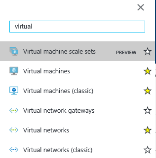

## Exercise 2: Setup Azure Data Factory

Duration: 20 mins

Synopsis: In this exercise, attendees will create a baseline environment for Azure Data Factory development for further operationalization of data movement and processing. They will create a Data Factory service and then install the Data Management Gateway which is the agent that facilitates data movement from on-premises to Microsoft Azure.

### Task 1: Connect to the Lab VM

1. From the left side of the Azure portal, click on **Browse &gt;**.
2. In the **filter** box, type in **virtual**.
3. Click on Virtual Machine.

    

1. Keep in mind the name of the virtual machine will be the &quot;APPNAME&quot; you provided when setting up this workshop environment.
2. Click on the **&lt;YOUR\_APP\_NAME&gt;lab** virtual machine from the list and click on **Connect**.
3. Download and open the RDP file.

    

1. When Remote Desktop Connection screen appear, check the box **Don&#39;t ask…** and click on **Connect** button.

    

1. Log in with the credentials you specified for the Lab VM during the deployment of the workshop prerequisites.

### Task 2: Install and Configure Data Management Gateway on the Lab VM

1. Once you have logged in to the Lab VM, open a web browser. A shortcut for Chrome is on the Desktop and Internet Explorer can be accessed from the Start Screen.
2. Download the AdventureWorks sample CSV file. You can download it from [http://aka.ms/flightsandweather](http://aka.ms/flightsandweather) and save it to a new folder called **C:\Data**.
3. To download the latest version of Microsoft Data Management Gateway, go to [https://aka.ms/dmgdownload](https://aka.ms/dmgdownload).
4. Click on the **Download** button from the middle of the webpage.
5. Select the 64-bit version and click **Next**.

    

1. Run the installer once downloaded.
2. When you see the following screen, click on the **Next** button.

    

1. Check the box to accept the terms and click **Next** button.
2. Click **Next**.
3. Click **Install**.
4. Click **Finish**.
5. Once the installation is complete, the following screen will appear; keep it open for now. Next, you will provision the Data Factory service in Azure and obtain the gateway key so we can connect Data Factory to this &quot;on-premises&quot; server.

    

### Task 3: Log in to the Azure Portal

1. Launch a new browser session and navigate to [https://portal.azure.com](https://portal.azure.com). Once prompted, log in with your Microsoft Azure credentials. If prompted, choose whether your account is an organization account or a Microsoft Account.  This will be based on which account was used to provision your Azure subscription that are using for these labs.
  - **Note** : You may need to launch an InPrivate/Incognito session in your browser if you have multiple Microsoft Accounts.

### Task 4: Create new Azure Data Factory Service

1. From left top corner of the Azure Portal, click on **+New**.

    

1. Select **Data + Analytics** , click on **Data Factory**.

    

1. Provide a name like [insert your initial here]-adf (example **jcho-adf** ).
2. Make sure to you have the right subscription selected.
3. For Resource Group, choose **Use Existing** and select the Resource Group you created when deploying the workshop prerequisites.
4. Select **East US** or **West US** for the region.
5. Check the box **Pin to dashboard** and click on the **Create** button.

    

1. Deployment of the ADF will take couple of minutes.
2. Once it has completed, you will be taken to the Data Factory blade.
3. Click on **Author and deploy**.

    

1. Click on **…More**.

    

1. Click on **New data gateway**.

    

1. Type in a **Data gateway name** like [insert your initial here]-dmg (example **jcho-dmg** ).
2. Click **OK** button.
3. Click on **Configure** and copy out the **NEW KEY**.
4. _Don&#39;t close the current browser session._
5. Go back to the Remote Desktop session of the virtual machine.
6. Paste the **Key** into the box in the middle of the screen.

    

1. Click on the **Register** button.
2. It will take couple of minutes to register. If it takes more than couple minutes and the screen does not respond or get an error message, then close the screen by click on the **Cancel** button.
3. You should see below screen with confirmation message.

    

1. Confirmed that gateway is connected by going to the system tray of the bottom right corner and double click on the follow icon.

    

1. You should see following screen:

    

1. You can go back to the Azure Data Factory browser page within the Azure Portal, and Click **OK** twice to finish setting up the Data gateway.

    
