# Exercise 3: Develop Data Factory Pipeline for Data Movement

Duration: 20 mins

Synopsis: In this exercise, attendees will implement Azure Data Factory pipeline to copy data (.csv file) from on-premises server (lab virtual machine) to Azure Blob Storage. The goal of the exercise is to demonstrate data movement from an on-premises location to Azure Storage (via the Data Management Gateway). The attendee will see how these assets are created, deployed, executed, and monitored.

## Task 1: Create Copy Pipeline Using the Copy Data Wizard

1. Go the Azure Portal and select Azure Data Factory (ADF) Service you create in previous exercise.

    

1. From **Actions** section, click on **Copy data**.

    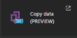

1. New browser window will open.  Under Properties tab, type in **CopyPipeline–OnPrem2Azure**.

    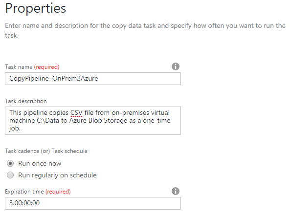

1. Optional: Type in a description like: **This pipeline copies CSV file from on-premises virtual machine C:\Data to Azure Blob Storage as a one-time job**.
2. Select the **Run once now** option.
3. Click on the **Next** button from the bottom of the screen.
4. From the Source Data Store screen tab, select **File Server Share**.

    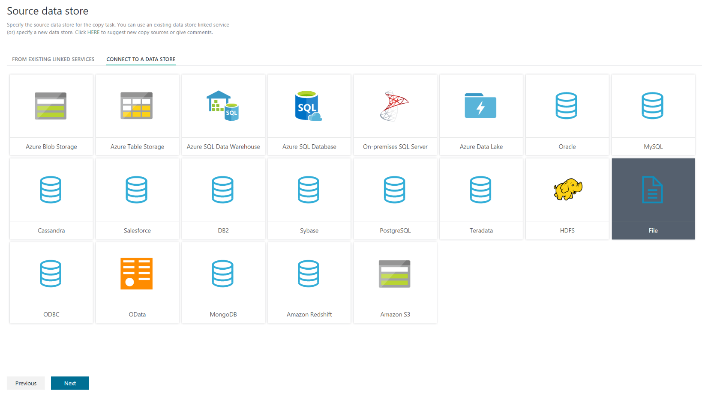

1. Click on **Next** button from the bottom of the screen.
2. From the Specify File Server share connection tab, type **InputConnection-OnPremServer** into the **Connection name** textbox.
3. For the **Path** , type in **C:\Data**.
4. For the **User name**, type in **cortana**.
5. For the **Password**, type in **Password.1!!**.
6. For the Gateway, it should already be filled in with the gateway connection you created in the previous exercise.

    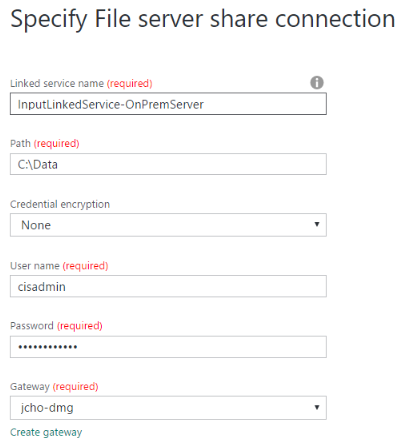

1. Click on the **Next** button from the bottom of the screen.
2. From the **Choose the input file or folder** tab, click on the **FlightsAndWeather.csv**.
3. Click on the **Choose** button from the bottom right corner of the screen.
4. Click on the **Next** button from the bottom of the screen.

    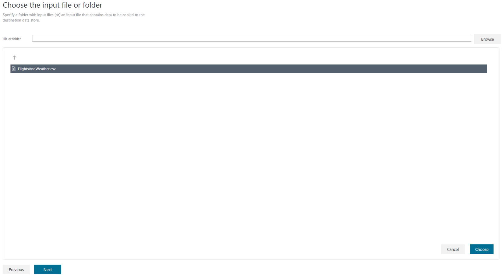

1. From the **File format settings** tab, leave everything as default except check the box **Column name in the first data row**.  You can see the preview of the file from the bottom of the screen.
2. Click **Next** button from the bottom of the screen.

    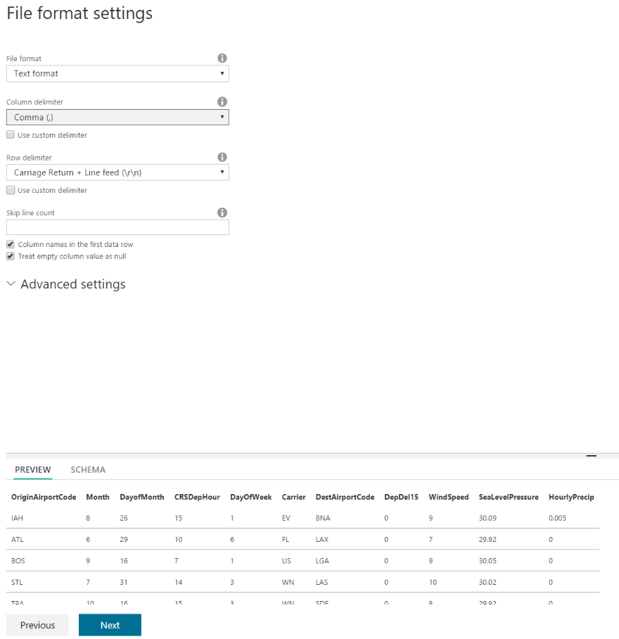

1. From the **Destination data store** tab, click on the **Azure Blob Storage**.
2. Click on the **Next** button from the bottom of the screen.

    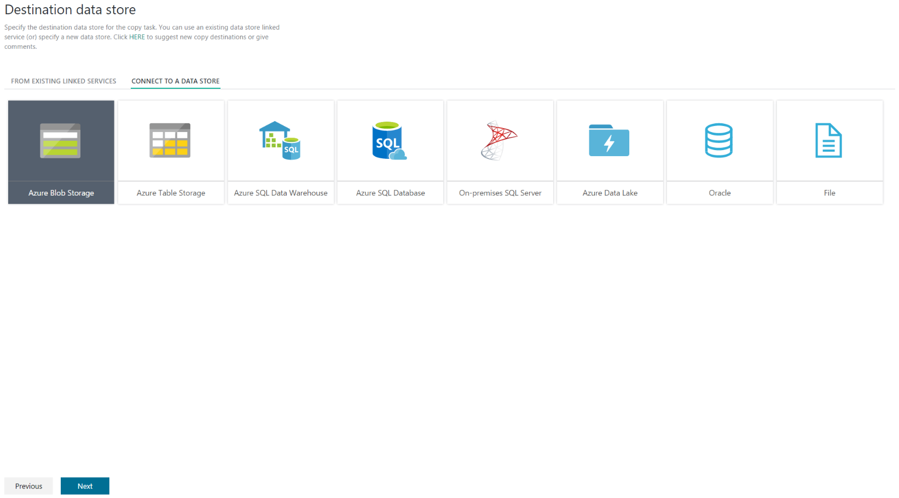

1. From the **Specify the Azure Blob storage account** tab, Type in **OutputLinkedService-AzureBlobStorage** into the **Connection name**.
2. From the **Storage account name** dropdown list, select **\<YOUR_APP_NAME\>sparkstorage**. _Make sure you select the storage account with the **sparkstorage** suffix or you will have issues with subsequent exercises._ This ensures that the data will be copied to the storage account that the Spark cluster uses for its data files.
3. Before clicking **Next** at the bottom of the screen, *please make sure you have selected the right storage account* (it will have the **sparkstorage** suffix). Finally, click **Next**.

    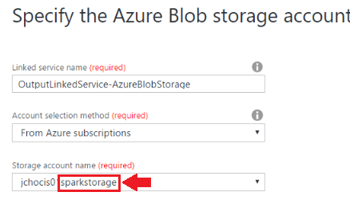

1. From the Choose the output file or folder tab, type in **sparkcontainer/flights** into the **folder path** textbox.
2. Click on the **Next** button from the bottom of the screen.

    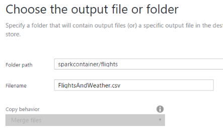

1. From the **File format settings** tab, leave everything as defaulted except check the box **Add header to file**. You can see the preview of the file from the bottom of the screen.
2. Click **Next** button from the bottom of the screen.

    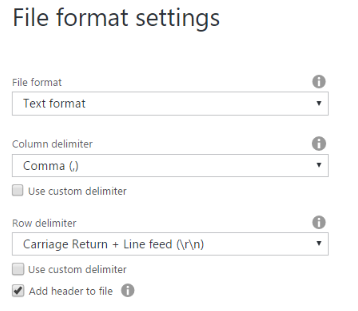

1. Review the summary tab and click **Finish** button from the bottom.
2. You should see a **Deploying** status. This process will take few minutes and see the **Deployment Complete** status on top of the screen.

    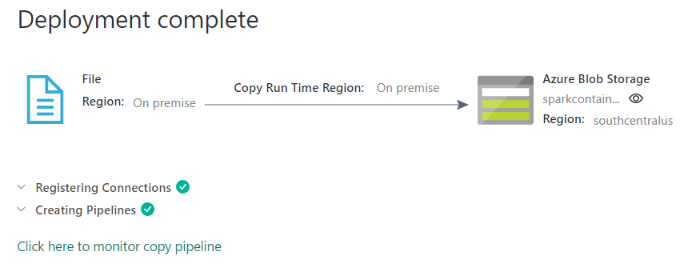

1. Click on the hyperlink **Click here to monitor copy pipeline**.
2. From the **Resource Explorer** , you should see from the **Activity Windows** (bottom of the screen) the pipeline activity status **Ready**. This indicates the CSV file was successfully copied from your VM to your Azure Blob Storage location.

    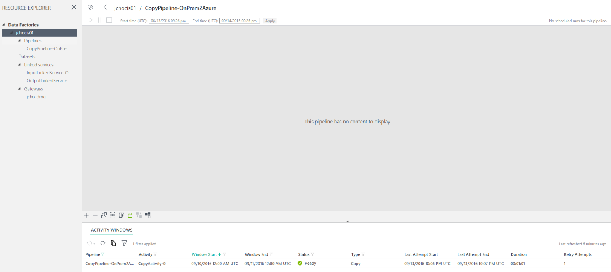

Next Exercise: [Exercise 4 - Operationalize ML Scoring with Azure ML and Data Factory](04 Exercise 4 - Operationalize ML Scoring with Azure ML and Data Factory.md)
