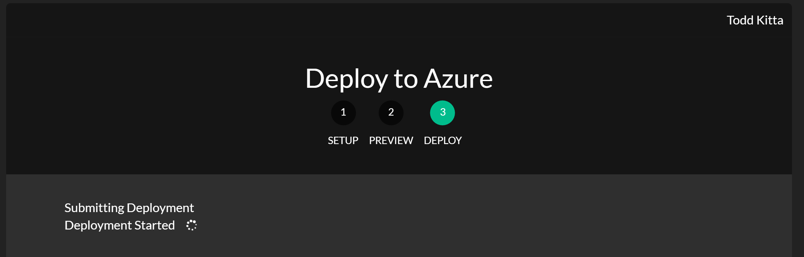
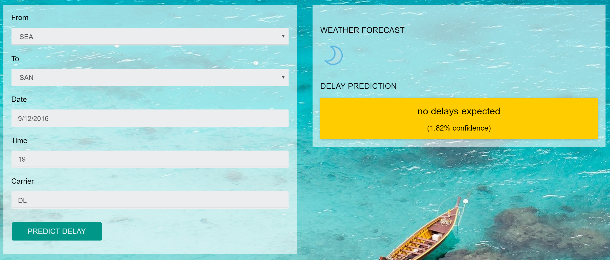

## Exercise 7: Deploy Intelligent Web App

Duration: 20 mins

Synopsis: In this exercise, attendees will deploy an intelligent web application to Azure from GitHub. This application leverages the operationalized machine learning model that was deployed in Exercise 1 to bring action-oriented insight to an already existing business process.

### Task 1: Deploy Web App from GitHub

1. Navigate to [http://aka.ms/cortanawebdeploy](http://aka.ms/cortanawebdeploy) in your browser of choice, but where you are already authenticated to the Azure Portal.
2. Read through the README information on the GitHub page.
3. Click the **Deploy to Azure** button.

    
1. On the following page, ensure the correct **Directory** and **Subscription** are selected.
2. Select the **Resource Group** that you have been using throughout the workshop.
3. Either keep the default **Site Name** or provide one that is globally unique and then choose a **Site Location**.
4. Finally, enter the ML API and Weather API information. Recall that you recorded the ML API information back in Task 8 of Exercise 1. Also, recall that you obtained the Weather API key back in the prerequisite steps for the workshop ([http://aka.ms/cortanasetup](http://aka.ms/cortanasetup)).
5. Click **Next** and on the following screen, click **Deploy**.
6. The page should begin deploying your application while showing you a status of what is currently happening.

    
1. After a short time, deployment will complete and you will be presented with a link to your newly deployed web application. CTRL+Click to open it in a new tab.
2. Try a few different combinations of origin, destination, date, and time. The information you are shown are the result of both the ML API you published as well as information retrieved from the Weather Underground API.

    
1. **Congratulations!** You have built and deployed an intelligent system to Azure!
