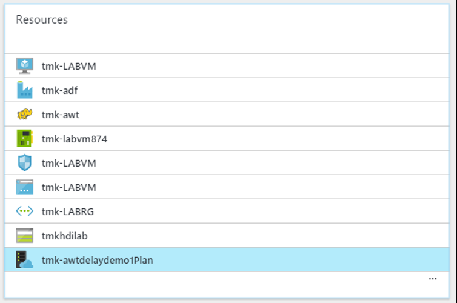

# Exercise 8: Cleanup of Azure Resources

Duration: 10 mins

Synopsis: In this exercise, attendees will de-provision any Azure resources that were created in support of the lab.

## Task 1: Delete Resource Group

1. Using the Azure Portal, navigate to the Resource Group that you used throughout the lab by clicking on **Resource Groups** in the left nav.

    
1. You will see the various assets created throughout the workshop, delete each one by clicking on it and then clicking the **Delete** button for each.
    * For the App Service plan, you will first need to delete the Web App within the plan before deleting the plan itself.

    

    
