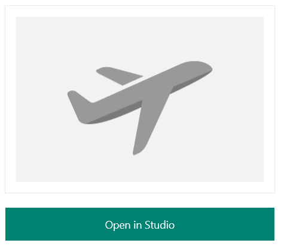
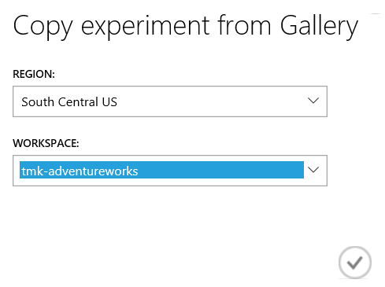
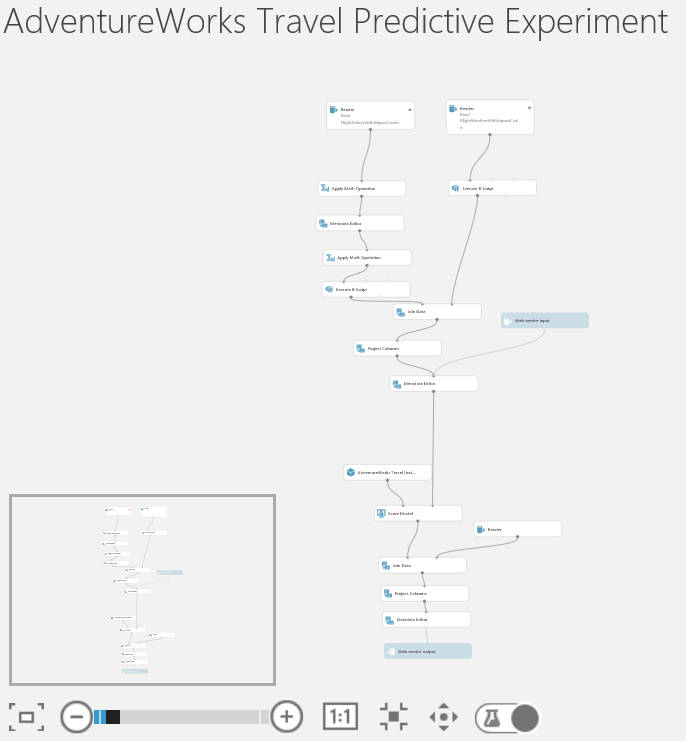
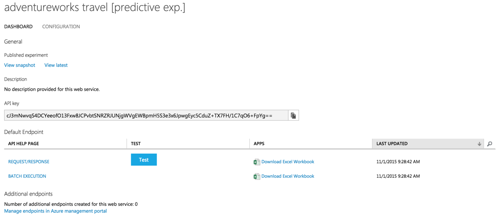

# Appendix A: Alternative to Azure ML Exercise

Duration: 20 mins

Synopsis: The purpose of this exercise is the same as Exercise 1 above. However, it is included as an alternative in the case attendees fall behind or are otherwise unable to complete the exercise. The attendee will import a complete predictive experiment into a workspace that he or she already created. This exercise assumes the attendee has already completed the first task of Exercise 1.

## Task 1: Import the Completed Predictive Experiment Into Your Workspace

1. Go to [http://aka.ms/cortanaml](http://aka.ms/cortanaml). This will open a completed version of the ML predictive experiment in the Cortana Intelligence Gallery.
2. Click the **Open in Studio** button on the right side of the screen.

    
1. When prompted on the next screen, select the **South Central US** region and your workspace.

    
1. After the copy operation finishes, the completed ML experiment will appear in your workspace.

    
1. Run the experiment. This will take 5-7 minutes.
2. When the experiment is finished running, click **Deploy Web Service**. When the deployment is complete, you will be taken to the Web Service dashboard.

    
1. At this point, you are now ready to return to and complete Exercise 2. The only task remaining is Task 8.
