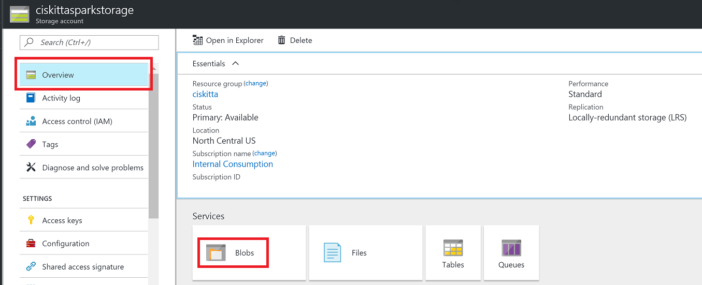
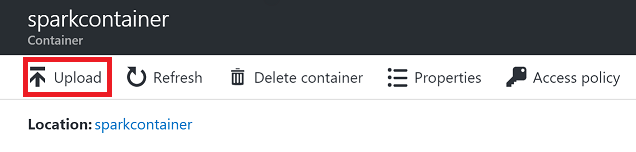
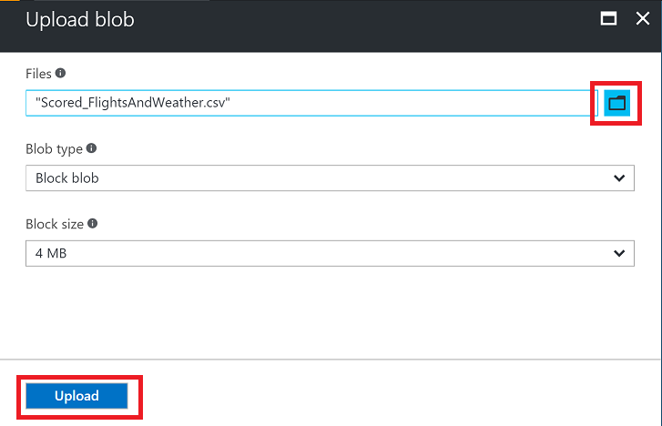

# Appendix B: Alternative to Azure Data Factory Exercises

Duration: 10 mins

Synopsis: The purpose of this exercise is to provide a "get out of jail free" card for the Azure Data Factory exercises. If you recall, the architecture of this workshop uses Azure Data Factory for two reasons: to copy data from an on-premises server and to score each row in that same file using the machine learning model that was created in [Exercise 1](01_Exercise_1_-_Building_a_Machine_Learning_Model.md). Therefore, this exercise will simply have you upload a file that has already been scored so you can continue with the remaining exercises. The file that is being uploaded is the same as the file that would result from completeing [Exercise 4](04_Exercise_4_-_Operationalize_ML_Scoring_with_Azure_ML_and_Data_Factory.md)

## Task 1: Download the Pre-Scored File

1. Go to [https://aka.ms/scoredfile](https://aka.ms/scoredfile). This will download a copy of the file that Azure Data Factory would have created in [Exercise 4](04_Exercise_4_-_Operationalize_ML_Scoring_with_Azure_ML_and_Data_Factory.md).
2. Once the file is downloaded, go to the [Azure Portal](http://portal.azure.com) and find the storage account that is the underlying storage for the Spark cluster; it will be called **XXXsparkstorage** (where **XXX** is the App Name you provided when you deployed the workshop prerequisites). An easy way to find your storage account is to navigate to the resource group you created during the workshop setup using the Resource Group item on the leftmost navigation area in the portal. Once you select your resource group you will see all of the resources that were created for the workshop (including the storage account).
3. Once here, select **Blobs** from the storage account blade (while making sure **Overview** is selected in the storage account navigation area).

4. Select **sparkcontainer** in the next blade.
5. In the next blade, click **Upload**.

6. In the **Upload Blob** blade, click the folder button next to the **Files** input and select the file you downloaded in step 1 above.
7. Click the **Upload** button at the bottom of the blade.

8. After the file uploads successfully, you can contine to [Exercise 5](05_Exercise_5_-_Summarize_Data_Using_HDInsight_Spark.md).
