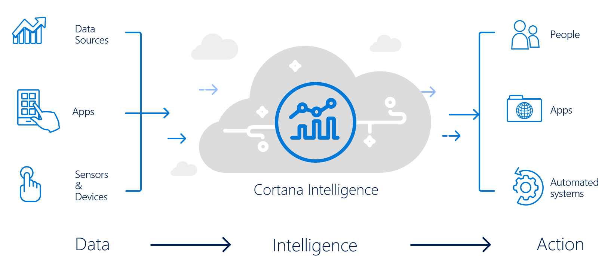

# Cortana Intelligence Suite End-to-end Workshop

# Workshop Overview

AdventureWorks Travel (AWT) provides concierge services for business travelers. In an increasingly crowded market, they are always looking for ways to differentiate themselves and provide added value to their corporate customers.

They are looking to pilot a web-app that their internal customer service agents can use to provide additional information useful to the traveler during the flight booking process. They want to enable their agents to enter in the flight information and produce a prediction as to if the departing flight will encounter a 15 minute or longer delay, taking into account the weather forecasted for the departure hour.

In this lab, attendees will build an end-to-end solution to predict flight delays taking into account the weather forecast.

# Requirements

- Microsoft Azure Subscription should be pay-as-you-go, MSDN, or EA.
  - Recommendation is to have each user have their own Azure subscription; this will allow every attendee to have their own sandbox.
- Setup is required before performing the steps in these exercises. Please see [http://aka.ms/cortanasetup](http://aka.ms/cortanasetup) before going any further.
- Please keep in mind that HDInsight cluster and VM you provision as setup for this workshop will incur charges, so provision these resources closest to the workshop date as possible.  Preferably the afternoon/night before the workshop.

# Exercises

- [Exercise 1 - Building a Machine Learning Model](01 Exercise 1 - Building a Machine Learning Model.md)
- [Exercise 2 - Setup Azure Data Factory](02 Exercise 2 - Setup Azure Data Factory.md)
- [Exercise 3 - Develop Data Factory Pipeline for Data Movement](03 Exercise 3 - Develop Data Factory Pipeline for Data Movement.md)
- [Exercise 4 - Operationalize ML Scoring with Azure ML and Data Factory](04 Exercise 4 - Operationalize ML Scoring with Azure ML and Data Factory.md)
- [Exercise 5 - Summarize Data Using HDInsight Spark](05 Exercise 5 - Summarize Data Using HDInsight Spark.md)
- [Exercise 6 - Visualizing in Power BI Desktop](06 Exercise 6 - Visualizing in Power BI Desktop.md)
- [Exercise 7 - Deploy Intelligent Web App](07 Exercise 7 - Deploy Intelligent Web App.md)
- [Exercise 8 - Cleanup of Azure Resources](08 Exercise 8 - Cleanup of Azure Resources.md)
- [Appendix A - Alternative to Azure ML Exercise](09 Appendix A - Alternative to Azure ML Exercise.md)